# Lab: Attaque par Force Brute (Itération, Dictionnaire & Hybride)

## 📝 Présentation du Laboratoire
* **Domaine** : Sécurité Offensive (Offensive Security)
* **Objectif** : Comprendre les mécanismes des attaques par force brute, analyser l'impact de la complexité des mots de passe et étudier les méthodes de remédiation.
* **Outils** : `Hydra`, `John the Ripper` ou outils équivalents selon les phases du TP.

---

## 🌐 Architecture & Environnement
* **Machine Cible** : **Metasploitable 2**
* **Machine Attaquante** : **Kali Linux**

---

## 🛡️ Réalisation des Manipulations

### Phase 1 : Attaque par itération (Force brute pure)
#### 1. Préparation de la cible
Pour simuler un scénario d'audit réel, une archive RAR chiffrée a été générée depuis un environnement Windows 10, contenant des documents fictifs mais structurellement valides (`Informations bancaires.xlsx` et `Secrets.txt.docx`).

* **Caractéristiques de l'archive :**
  * **Algorithme cible** : RAR5 / WinRAR
  * **Mot de passe appliqué** : `1234` (faible, propice à la force brute pure)
  * **Option activée** : Chiffrement des noms de fichiers (masquage des métadonnées)

L'archive a ensuite été transférée sur le bureau de la machine attaquante Kali Linux pour la suite des manipulations.

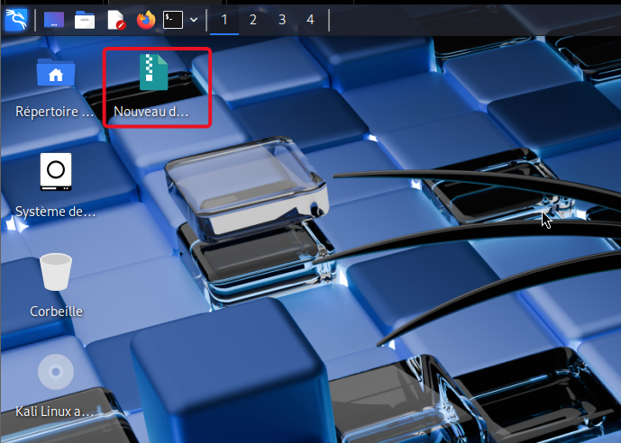

#### 2. Extraction de l'empreinte cryptographique (Hash)
Pour mener l'attaque de manière optimale, l'outil `rar2john` a été utilisé afin d'extraire le hash du mot de passe de l'archive sans altérer le fichier initial.

* **Commande exécutée :**
  ```bash
  rar2john "Nouveau dossier.rar" > hash.txt
  ```

#### 3. Exécution de l'attaque par force brute
Pour casser le hash extrait, l'outil `John the Ripper` a été configuré en mode incrémentiel (force brute pure). Ce mode teste systématiquement toutes les combinaisons de caractères possibles.

* **Commande exécutée :**
  ```bash
  john --incremental hash.txt
  ```

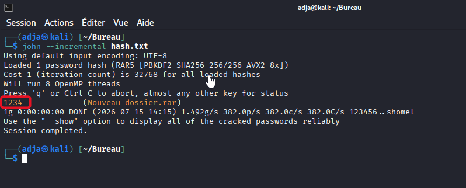

### Phase 2 : Attaque par dictionnaire
#### 1. Reconnaissance et Cartographie de la cible
Avant de lancer l'attaque, une phase de reconnaissance a été menée pour identifier l'adresse IP de la cible Metasploitable 2 et vérifier la disponibilité de ses services.

* **Identification de l'IP cible (Metasploitable 2) :** `192.168.232.128`

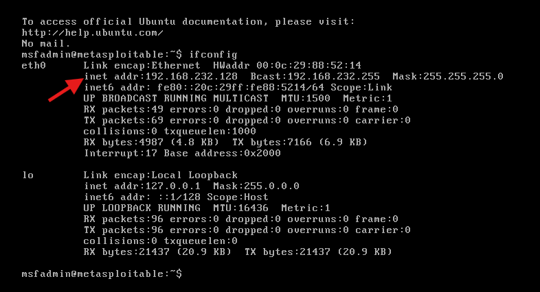

* **Scan de ports avec Nmap :**
  Un scan ciblé a été effectué depuis Kali Linux pour confirmer l'état du port FTP et détecter la version exacte du service en cours d'exécution.

  ```bash
  nmap -sV -p 21 192.168.232.128
  ```

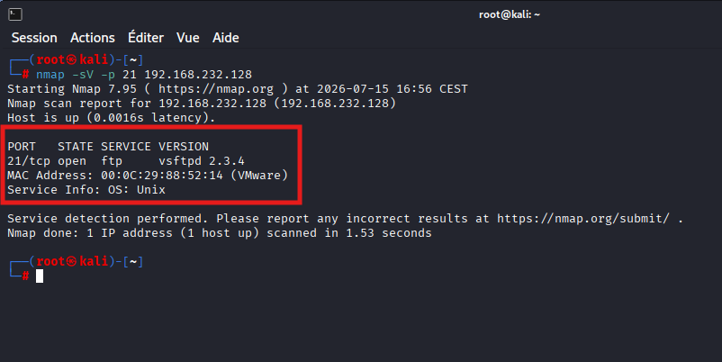

#### 2. Création et préparation des dictionnaires de test
Pour mener à bien notre attaque par dictionnaire sur le protocole FTP, nous devons disposer d'une liste d'utilisateurs cibles et d'une liste de mots de passe potentiels. 

* **Création du dictionnaire d'utilisateurs (`usernames.txt`) :**
  ```bash
  echo -e "alpha\nmsfadmin\nmaestro\nadja\nhouleye\nbachir\narmand\nabd" > usernames.txt 
  ```

* **Création du dictionnaire de mots de passe (`passwords.txt`) :**
  ```bash
  echo -e "armand\nabd\nadja\nalpha\nhouleye\nmsfadmin\nbachir" > passwords.txt
  ```

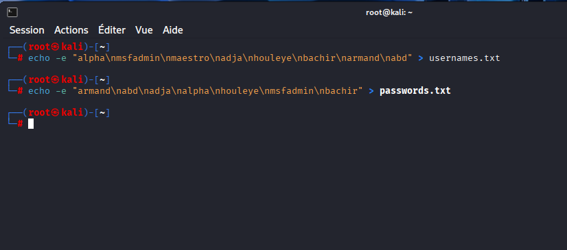

#### 3. Lancement de l'attaque par dictionnaire avec THC-Hydra
Pour identifier des identifiants valides sur le service FTP, nous utilisons l'outil **Hydra**. Cet outil va tester de manière automatisée chaque combinaison de notre liste d'utilisateurs (`usernames.txt`) avec notre liste de mots de passe (`passwords.txt`).

La commande exécutée est la suivante :
```bash
hydra -L usernames.txt -P passwords.txt ftp://192.168.232.128
```

*   **`-L usernames.txt`** : spécifie le dictionnaire contenant les noms d'utilisateurs.
*   **`-P passwords.txt`** : spécifie le dictionnaire contenant les mots de passe.
*   **`ftp://...`** : cible le protocole FTP sur l'adresse IP de la machine Metasploitable.

L'outil parvient rapidement à découvrir une combinaison valide : l'utilisateur **msfadmin** associé au mot de passe **msfadmin**.

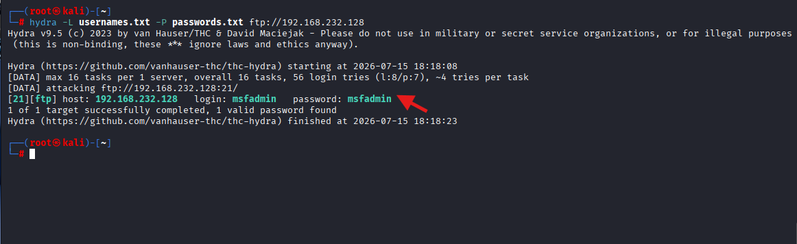

#### 4. Connexion au service FTP cible
Suite au succès de l'attaque par dictionnaire, nous utilisons l'outil client standard `ftp` pour nous connecter à la machine cible avec les identifiants compromis.

La commande de connexion est la suivante :
```bash
ftp 192.168.232.128
```

*   **Nom d'utilisateur** : `msfadmin`
*   **Mot de passe** : `msfadmin`

La session s'ouvre avec succès, confirmant la vulnérabilité du service et nous donnant un accès direct au serveur de fichiers de la cible.

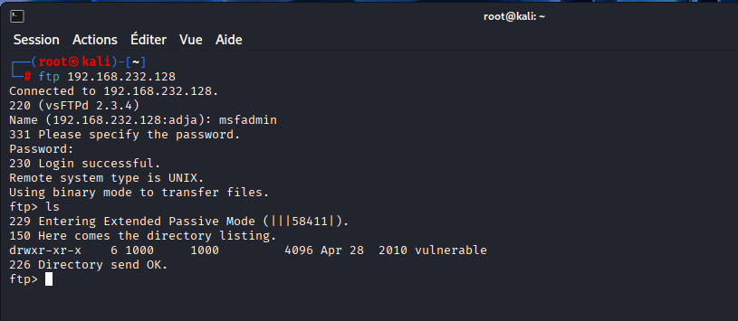

#### 5. Utilisation d'un outil alternatif : Ncrack
Afin de diversifier nos méthodes de test, nous effectuons la même attaque par dictionnaire en exploitant un autre outil spécialisé d'audit de sécurité : **Ncrack**.

La commande exécutée est la suivante :
```bash
ncrack -U usernames.txt -P passwords.txt 192.168.232.128:21
```

*   **`-U usernames.txt`** : indique le fichier contenant les noms d'utilisateurs à tester.
*   **`-P passwords.txt`** : indique le fichier de mots de passe.
*   **`192.168.232.128:21`** : cible spécifiquement le port 21 (FTP) de la machine cible.


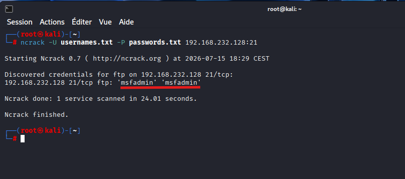
Comme attendu, Ncrack identifie avec succès les mêmes identifiants d'accès : **msfadmin** / **msfadmin**.

### Phase 3 : Attaque hybride
Une attaque hybride permet de combiner un mot de base issu d'un dictionnaire de référence avec un masque dynamique (par exemple, l'ajout de chiffres ou de caractères spéciaux) pour s'adapter aux habitudes courantes de création de mots de passe.

#### 1. Génération de l'archive et extraction du hash
Pour simuler ce scénario, nous utilisons une archive RAR nommée `hybride.rar` protégée par le mot de passe `password0000`. Nous procédons à l'extraction de la signature de sécurité (hash) de cette archive afin de pouvoir la soumettre à nos outils de craquage.

La commande d'extraction utilisée est la suivante :
```bash
rar2john hybride.rar > hybrid.txt
```

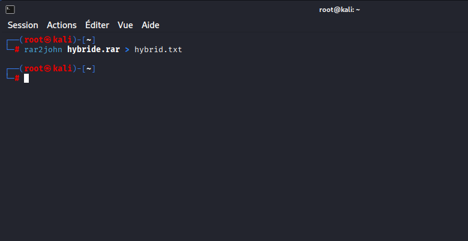

#### 2. Préparation du dictionnaire et nettoyage du hash
Avant de pouvoir soumettre notre empreinte à l'outil de craquage, deux étapes de préparation logicielle sont indispensables :

*   **Création du dictionnaire de base (`dict2.txt`) :**
    Nous générons un dictionnaire minimaliste contenant le mot de base à décliner lors de l'attaque.
    ```bash
    echo "password" > dict2.txt
    ```

*   **Nettoyage du hash dans `hybrid.txt` :**
    L'outil de craquage nécessite un hash pur pour s'exécuter correctement. Nous éditons le fichier extrait pour supprimer le nom du fichier d'origine (`hybride.rar:`) situé au tout début de la ligne, afin que celle-ci débute directement par la signature `$rar5$...`.

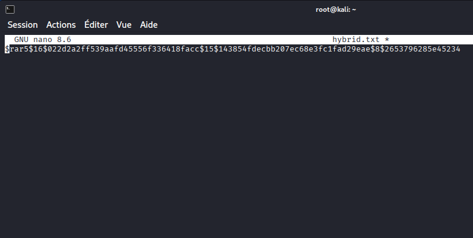

#### 3. Exécution de l'attaque hybride avec John the Ripper
Avec notre dictionnaire de base et notre hash correctement formaté, nous configurons John the Ripper pour réaliser l'attaque hybride. L'outil va adjoindre à notre mot de base (`password`) toutes les combinaisons possibles de quatre chiffres (de `0000` à `9999`).

La commande de craquage est la suivante :
```bash
john --format=rar5 --wordlist=dict2.txt --mask='?w?d?d?d?d' hybrid.txt
```

*   **`--format=rar5`** : spécifie le format de chiffrement de l'archive cible.
*   **`--wordlist=dict2.txt`** : charge notre dictionnaire de base contenant le mot `password`.
*   **`--mask='?w?d?d?d?d'`** : définit la règle d'association hybride. Le paramètre `?w` représente le mot extrait du dictionnaire, et les quatre variables `?d` représentent la suite de chiffres à tester en suffixe.
*   **`hybrid.txt`** : le fichier contenant la signature d'empreinte de notre archive.

L'outil analyse et teste rapidement les combinaisons pour casser la clé et afficher le mot de passe récupéré : **password0000**.

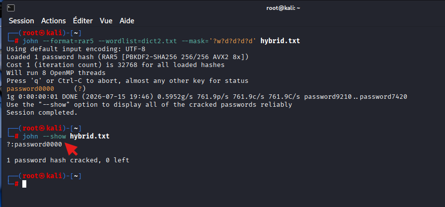

---

## 📋 Conclusion & Remédiation

Ce TP a mis en évidence la facilité avec laquelle un attaquant peut compromettre des accès en exploitant des protocoles obsolètes ou des politiques de mots de passe trop faibles. 

À travers nos différentes manipulations, nous avons réussi à :
1. Découvrir des identifiants valides sur un service FTP actif à l'aide d'attaques par dictionnaire automatisées (avec **Hydra** et **Ncrack**).
2. Extraire et casser avec succès l'empreinte de sécurité (hash) d'une archive chiffrée en combinant l'usage d'un dictionnaire de base et d'un masque de chiffres (attaque hybride avec **John the Ripper**).


#### Recommandations et Remédiations de Sécurité

Afin de prémunir l'infrastructure contre ces vecteurs d'attaque, plusieurs mesures correctives strictes doivent être implémentées :

##### 1. Sécurisation des transferts de fichiers
*   **Désactiver le protocole FTP standard :** le protocole FTP (port 21) fait transiter les identifiants et les données en clair sur le réseau, ce qui l'expose aux attaques d'interception (sniffing).
*   **Migrer vers des protocoles sécurisés :** remplacer FTP par **SFTP** (SSH File Transfer Protocol) ou **FTPS** (FTP over SSL/TLS) pour garantir le chiffrement de bout en bout des sessions d'authentification et des transferts de données.

##### 2. Renforcement de la politique d'authentification
*   **Complexité des mots de passe (Anti-Dictionnaire) :** imposer des règles strictes via des politiques de groupe (GPO ou configurations PAM sous Linux) exigeant une longueur minimale (12 caractères minimum), l'usage de majuscules, minuscules, chiffres et caractères spéciaux. Les mots du dictionnaire ou dérivés simples (comme `password0000`) doivent être proscrits par des filtres de dictionnaire.
*   **Politique de verrouillage des comptes (Anti-Force Brute) :** configurer un mécanisme de blocage temporaire du compte (par exemple, verrouillage de 15 minutes après 3 à 5 tentatives d'authentification infructueuses) ou utiliser des outils d'analyse de logs actifs comme **Fail2ban** pour bannir dynamiquement les adresses IP à l'origine de requêtes d'authentification suspectes et répétées.
*   **Authentification Multifacteur (MFA) :** déployer le MFA partout où cela est techniquement viable afin qu'un mot de passe compromis par dictionnaire ne suffise plus à lui seul pour s'emparer d'un accès.

##### 3. Durcissement des archives et documents chiffrés
*   **Algorithmes de chiffrement forts :** bien que l'archive RAR5 utilise un algorithme robuste (PBKDF2-SHA256), la sécurité repose entièrement sur la robustesse de la clé de chiffrement. Il convient d'utiliser exclusivement des phrases de passe (passphrases) longues et complexes, impossibles à deviner par approche hybride ou par masque.