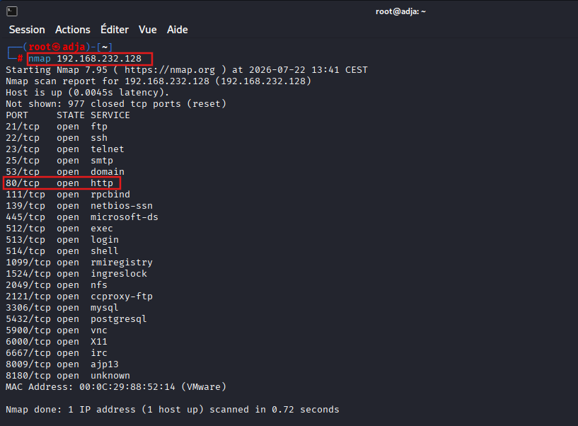
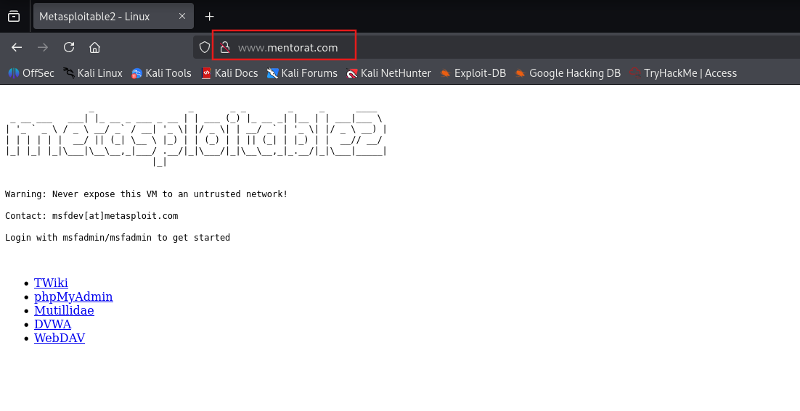
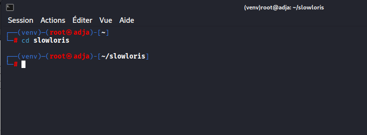
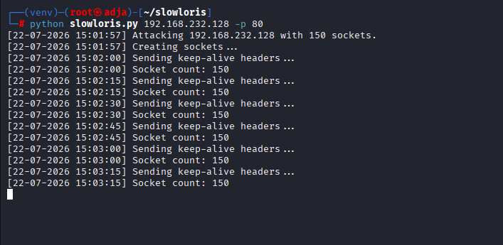
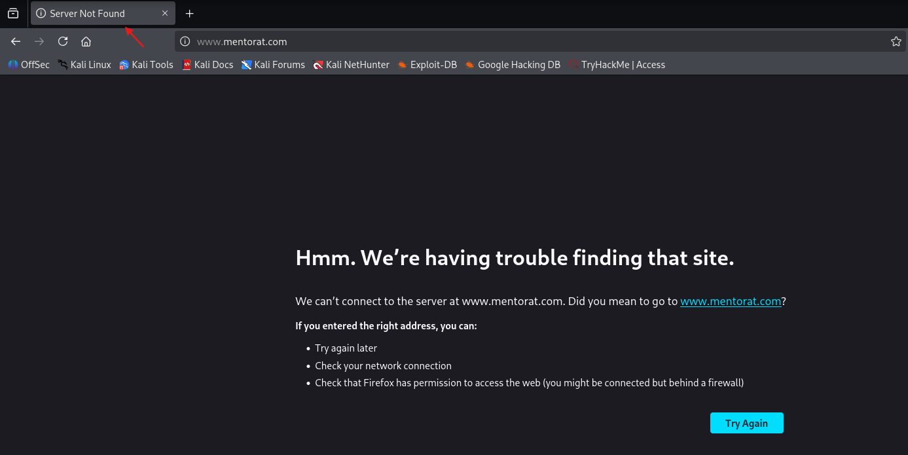
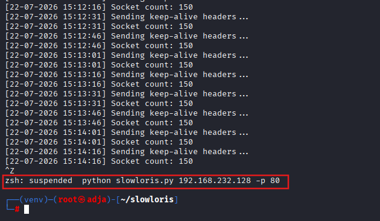
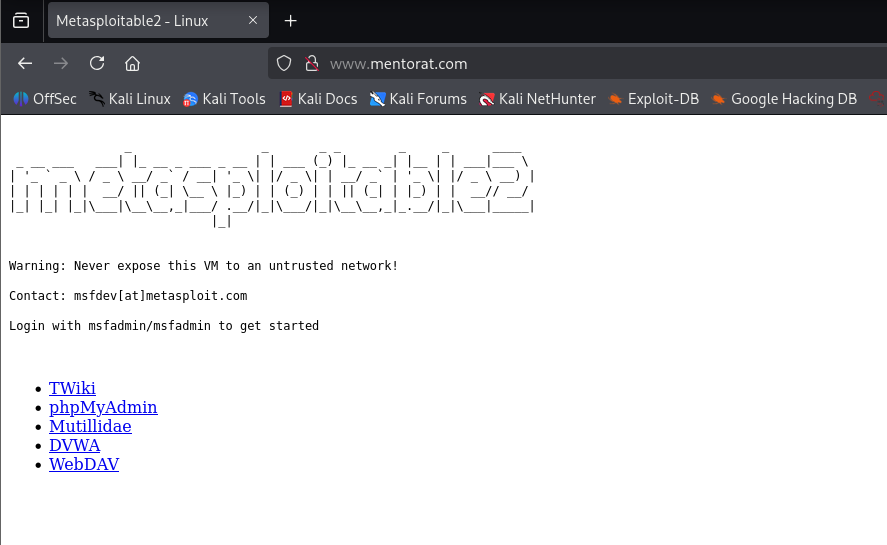
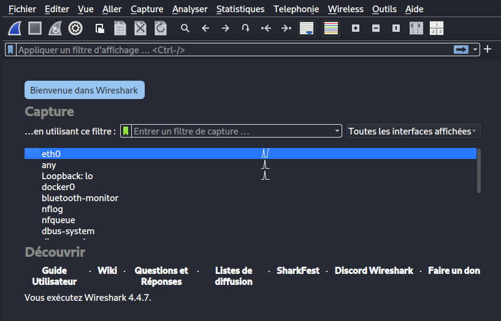
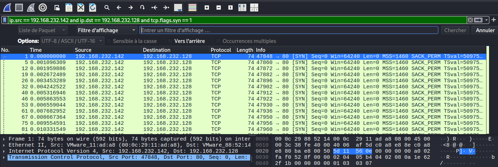
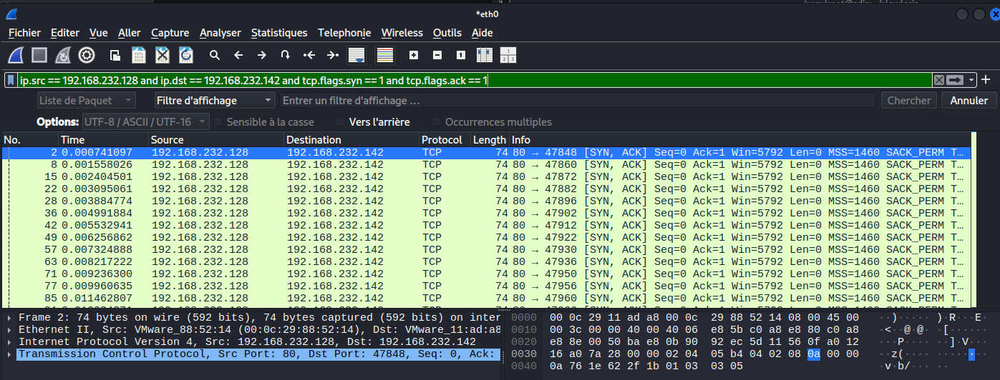

# SECURITE DES RESEAUX : ATTAQUES PAR DENIS SERVICE : DoS/DDoS

## Informations Générales
* **Machine Attaquante :** Kali Linux (`192.168.232.142`)
* **Machine Cible :** Metasploitable 2 (`192.168.232.128`)

---

## Étape 1 : Phase de Reconnaissance et Scan de Ports

Avant de mener toute action, il est indispensable de cartographier la cible pour identifier les services actifs. Nous effectuons un scan ciblé à l'aide de l'outil **Nmap** afin de vérifier si le serveur Web (port 80) est accessible et opérationnel.

```bash
nmap -p 80 [VOTRE_IP_CIBLE]
```

## Étape 2 : Configuration de la Résolution de Noms (`/etc/hosts`)

Afin d'accéder à la cible via son nom de domaine dédié, nous éditons le fichier `/etc/hosts` de la machine Kali Linux (`192.168.232.142`) pour associer l'adresse IP de Metasploitable 2 (`192.168.232.128`) au domaine `www.mentorat.com`.

```bash
sudo nano /etc/hosts
```
Nous vérifions ensuite la bonne prise en compte de la résolution de nom en accédant au serveur Web cible depuis le navigateur Web de la machine Kali à l'adresse `http://www.mentorat.com`.



## Étape 3 : Installation de l'Outil Slowloris

Afin de réaliser la simulation d'attaque par déni de service (DoS), nous clonons le dépôt officiel de l'outil [Slowloris sur GitHub](https://github.com/gkbrk/slowloris.git). Cet outil permet d'envoyer des requêtes HTTP incomplètes et de maintenir de nombreuses connexions ouvertes pour saturer la table de connexions du serveur Web.

```bash
sudo git clone https://github.com/gkbrk/slowloris.git
```
## Étape 4 : Installation des Dépendances et Lancement de Slowloris

### 4.1. Installation de la dépendance `socketpool`

Avant d'exécuter le script, nous installons le paquet Python `socketpool` nécessaire à la gestion des sockets de connexion.

```bash
pip install socketpool
```
Nous nous déplaçons ensuite dans le dossier cloné slowloris afin d'accéder au script principal.


### 4.2. Exécution du test de déni de service (DoS)
Nous lançons l'attaque Slowloris en ciblant l'adresse IP de notre machine Metasploitable 2 (192.168.232.128) sur le port HTTP (80).
```bash
python slowloris.py 192.168.232.128 -p 80
```


L'attaque est lancée avec les paramètres par défaut : 150 sockets ouvertes en parallèle, un délai de conservation des connexions (`--sleeptime`) de 15 secondes, sans proxy ni chiffrement HTTPS.

### 4.3. Vérification de l'impact du Déni de Service (DoS)
Afin de vérifier l'efficacité du déni de service, nous tentons d'accéder au serveur Web cible comme le ferait un utilisateur légitime en consultant l'URL http://www.mentorat.com depuis le navigateur Firefox.


Le navigateur affiche l'erreur **"Server Not Found / We're having trouble finding that site"**, confirmant que le serveur est saturé et incapable de répondre aux nouvelles requêtes d'accès.


Le serveur redevient disponible apres l'arret de l'execution de slowloris



## Étape 5 : Capture et Analyse du Trafic Réseau avec Wireshark

Afin d'observer la signature réseau du déni de service, nous utilisons **Wireshark**, un analyseur de paquets réseau permettant de capturer et d'inspecter le trafic en temps réel.

### 5.1. Lancement de Wireshark

Nous démarrons l'outil depuis le terminal de la machine Kali Linux :

```bash
wireshark
```
### 5.1. Capture du trafic et relancement de Slowloris
Apres sélection de l'interface réseau active (eth0) correspondant au réseau local de la machine cible et que la capture sur Wireshark démarrée, nous relançons le script Slowloris afin d'intercepter la génération des requêtes HTTP incomplètes et le maintien des connexions TCP.


### 5.2.Analyse des Indicateurs d'Attaque sous Wireshark
Après avoir laissé tourner l'attaque quelques instants pour générer du trafic, nous retournons sur Wireshark et stoppons la capture. Nous allons maintenant filtrer les paquets pour isoler les indicateurs caractéristiques de l'attaque.
```text
ip.src==192.168.232.142 and ip.dst==192.168.232.128 and tcp.flags.syn == 1
```
Ce filtre affiche uniquement les paquets TCP envoyés depuis notre machine Kali (192.168.232.142) vers la cible Metasploitable 2 (192.168.232.128) et dont le bit SYN est activé. Il sert à repérer la multitude de paquets qui initient une connexion TCP entre ces deux machines, typique du comportement de Slowloris qui ouvre un maximum de sockets.



### 5.3. Analyse des Réponses du Serveur (SYN-ACK) et Épuisement TCP

Pour analyser la réaction du serveur face à l'attaque, nous appliquons un second filtre d'affichage sous Wireshark afin d'isoler les accusés de réception émis par la cible :

```text
ip.src == 192.168.232.128 and ip.dst == 192.168.232.142 and tcp.flags.syn == 1 and tcp.flags.ack == 1
```
