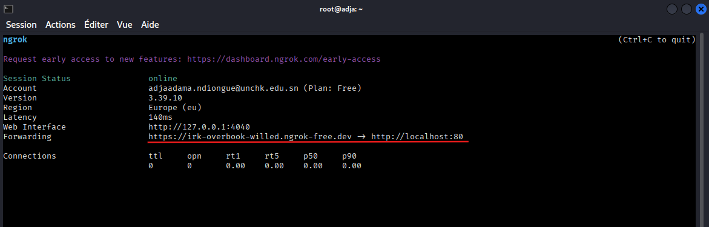

# Lab : Sensibilisation au Phishing et Simulation de Clonage de Compte (Facebook)

## Informations Générales
* **Type de Lab** : Ingénierie sociale / Phishing
* **Système attaquant** : Kali Linux
* **Système cible** : Utilisateur distant / Cible simulée
* **Outils utilisés** : [Outils à renseigner au fur et à mesure]
* **Objectif** : Comprendre les mécanismes du phishing par clonage d'interface web, analyser les vecteurs d'attaque par ingénierie sociale et sensibiliser aux risques liés à la compromission d'identifiants sur les réseaux sociaux.

## Réalisation des Manipulations
### 1. Lancement du tunnel Ngrok
Cette étape consiste à exposer le service local sur Internet afin de le rendre accessible depuis l'extérieur.

**Commande exécutée** :
  ```bash
  ngrok http 80
  ```
**Role** : création d'un tunnel sécurisé (reverse proxy) pointant vers le port local 80 (où s'exécute le serveur web ou le framework de phishing sur Kali).

**Resultat** : génération d'une URL publique temporaire en https:// permettant de rediriger le trafic de la victime vers notre machine.

