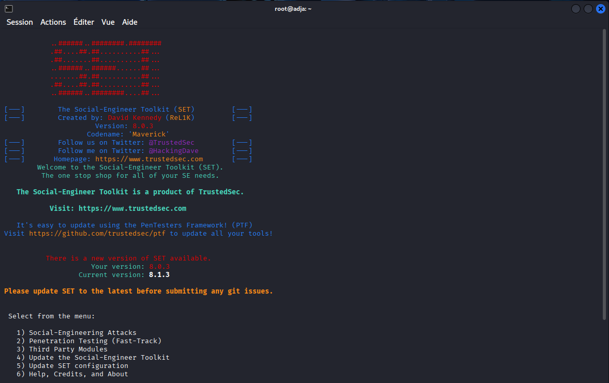
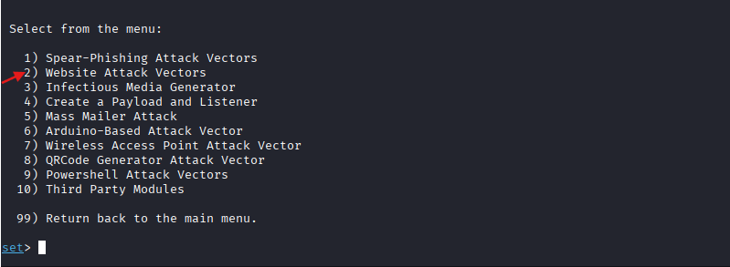
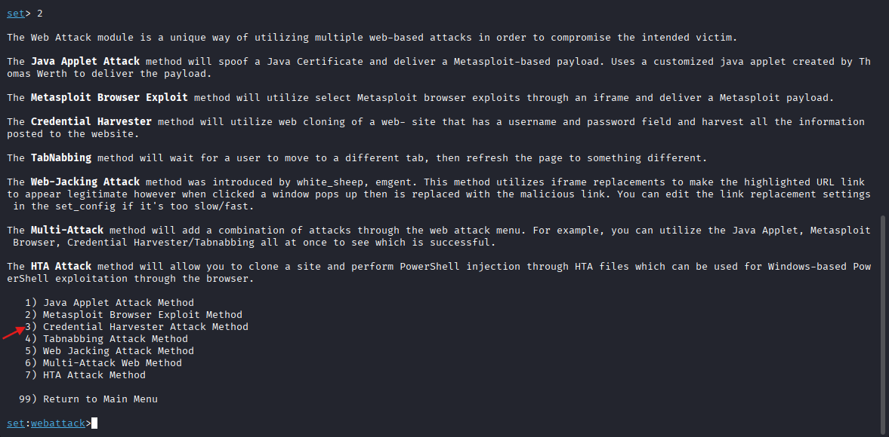
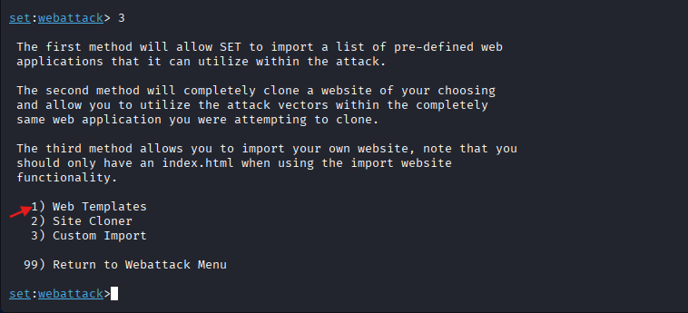
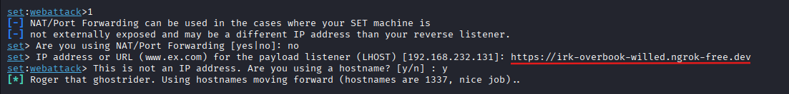
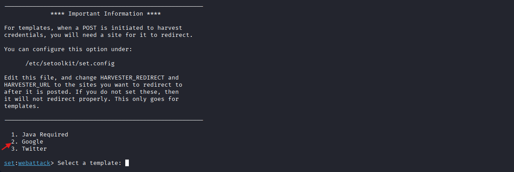
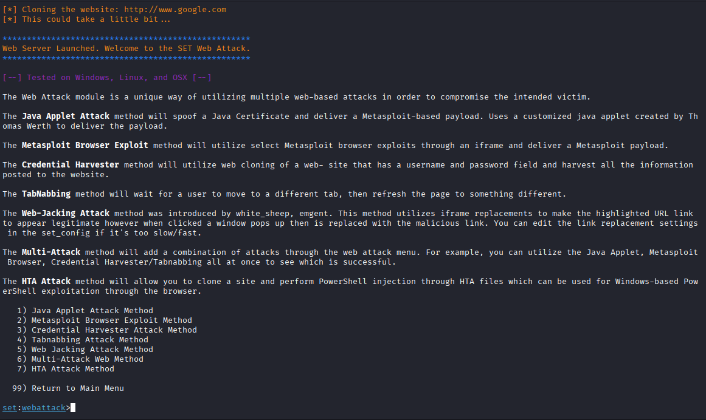

# Lab : Sensibilisation au Phishing et Simulation de Clonage de Compte (Facebook)

## Informations Générales
* **Type de Lab** : Ingénierie sociale / Phishing
* **Système attaquant** : Kali Linux
* **Système cible** : Utilisateur distant / Cible simulée
* **Outils utilisés** : [Outils à renseigner au fur et à mesure]
* **Objectif** : Comprendre les mécanismes du phishing par clonage d'interface web, analyser les vecteurs d'attaque par ingénierie sociale et sensibiliser aux risques liés à la compromission d'identifiants sur les réseaux sociaux.

## Réalisation des Manipulations
### 1. Lancement du tunnel Ngrok
Cette étape consiste à exposer le service local sur Internet afin de le rendre accessible depuis l'extérieur.

**Commande exécutée** :
  ```bash
  sudo ngrok http 80
  ```
**Role** : création d'un tunnel sécurisé (reverse proxy) pointant vers le port local 80 (où s'exécute le serveur web ou le framework de phishing sur Kali).

**Resultat** : génération d'une URL publique temporaire en https:// permettant de rediriger le trafic de la victime vers notre machine.


### 2. Lancement et initialisation de SET (Social-Engineer Toolkit)
Cette étape consiste à démarrer l'outil d'ingénierie sociale sur la machine attaquante (Kali Linux) pour préparer la mise en place du scénario de phishing.

**Commande exécutée** :
  ```bash
  sudo setoolkit
  ```


-Au menu principal, choisir l'option **`1`** pour accéder aux *Social-Engineering Attacks*.

-Au menu suivant, choisir l'option **`2`** pour sélectionner les *Website Attack Vectors*.


-Sur le menu des vecteurs web qui s'affiche, choisir l'option **`3`** pour cibler le Credential Harvester Attack Method*.


-Pour la méthode de récupération, choisir l'option **`1`** pour utiliser les *Web Templates*.

-À la question sur l'utilisation du NAT/Port Forwarding (*Are you using NAT/Port Forwarding*), répondre **`no`** puisque le tunnel Ngrok gère l'exposition externe. Puis pour l'adresse IP ou l'URL du listener (LHOST), renseigner l'URL publique générée par le tunnel Ngrok, avant de répondre par **`y`** à la vérification du format (*This is not an IP address. Are you using a hostname?*),  pour valider l'utilisation d'un nom d'hôte.


-Dans le menu de sélection du modèle (*Select a template*), choisir l'option **`2`** pour le template **Google**.




À ce stade, le serveur web de SET est lancé et le clonage du site est effectif (Web Server Launched). L'outil est désormais en attente (listener actif) et prêt à intercepter le trafic de la victime.

La prochaine action consiste à tester le lien avec la machine cible en ouvrant l'URL Ngrok dans un navigateur(notre machine hote) pour simuler l'interaction de la victime et observer la capture des informations.