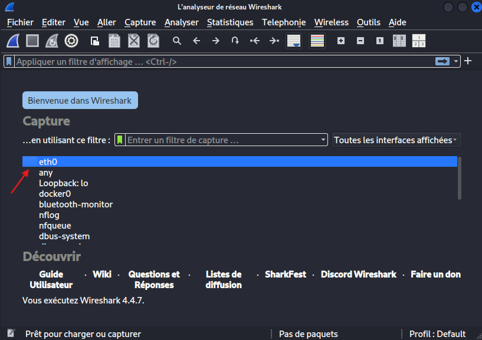
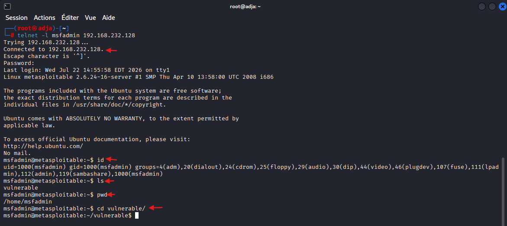
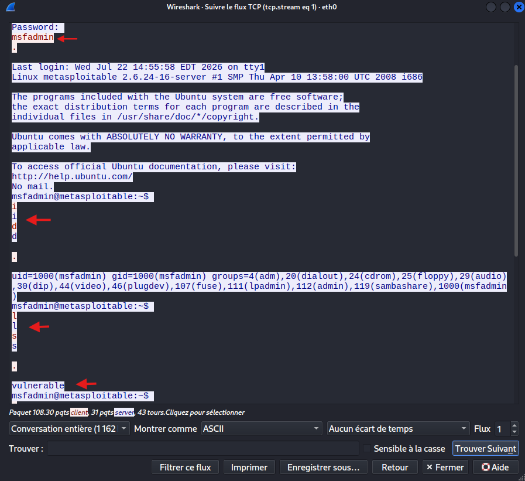
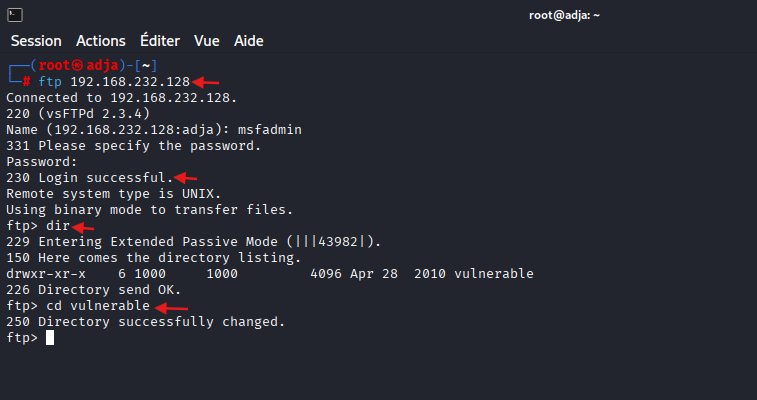
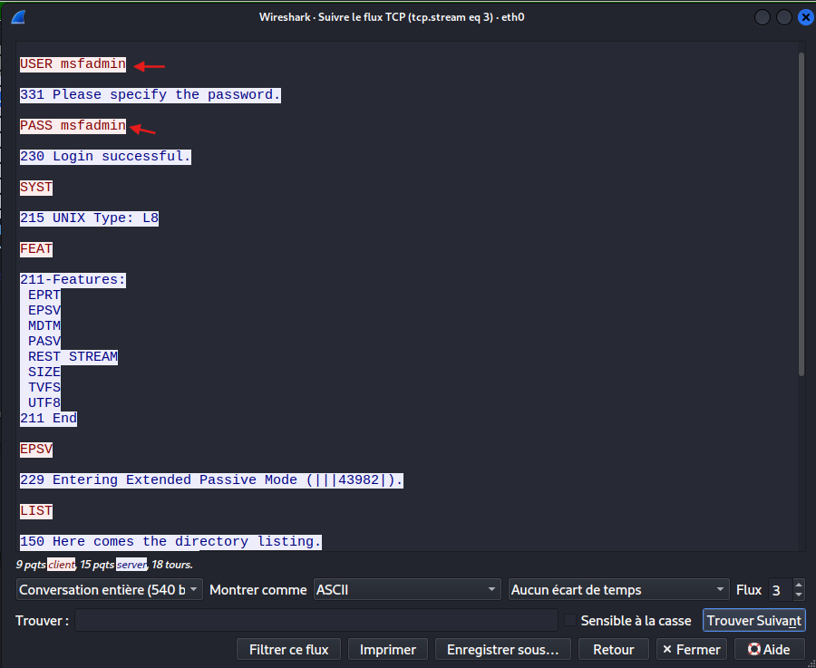
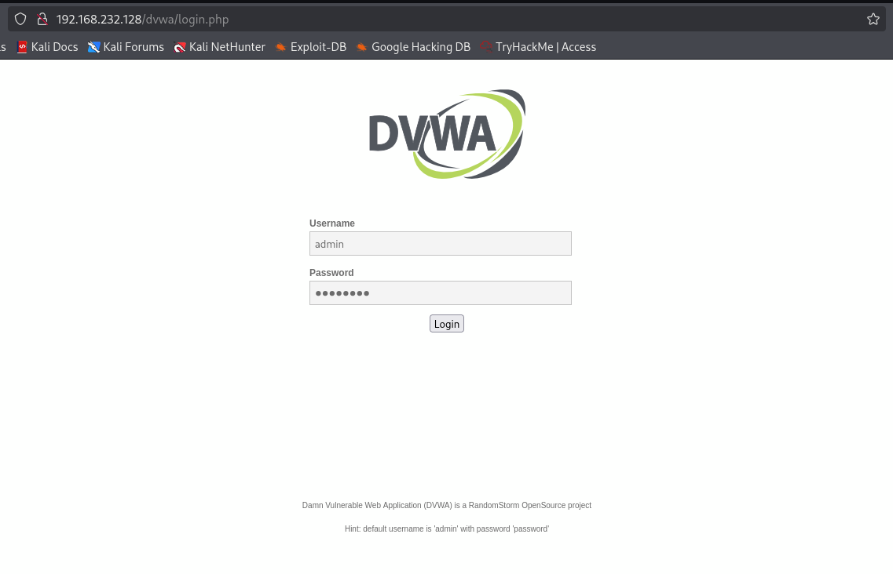
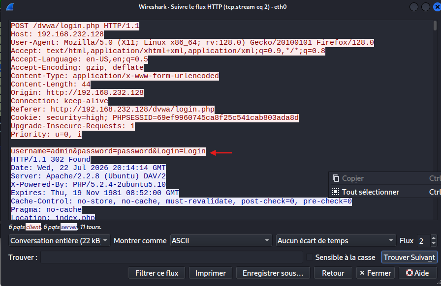

# Lab : Analyse de trafic et sniffing avec Wireshark

## Informations Générales
* **Type de Lab** : Analyse de trafic / Sniffing
* **Système attaquant** : Kali Linux
* **Système cible** : Metasploitable 2
* **Outils utilisés** : Wireshark
* **Objectif** : mettre en œuvre une capture de trafic en clair sur une infrastructure réseau, exploiter les faiblesses des protocoles non sécurisés (Telnet, FTP, HTTP) et extraire des identifiants ainsi que des flux textuels à l'aide de filtres et de la reconstruction de flux TCP sous Wireshark.

## Réalisation des Manipulations
La première étape consiste à lancer l'analyseur de paquets depuis le terminal de la machine attaquante pour observer le trafic réseau traversant la carte réseau connectée au réseau de la cible.
### Phase 1 : Initialisation et Capture du Trafic
La première étape consiste à lancer l'analyseur de paquets depuis le terminal de la machine attaquante pour observer le trafic réseau traversant la carte réseau connectée au réseau de la cible.

1. Lancer Wireshark via la ligne de commande :
   ```bash
   wireshark
   ```
   

### Phase 2 : Analyse du Protocole Telnet (Administration à distance)
Cette partie documente l'utilisation d'un protocole d'administration à distance non chiffré et la mise en évidence de la fuite d'informations d'authentification.
1. Connexion et actions sur la cible
```bash
telnet -l msfadmin 192.168.232.128
```
2. Authentification et exécution des commandes d'administration :
   * Saisie du mot de passe associé (`msfadmin`).
   * Exécution de commandes de vérification et de navigation système :
```bash
     id
     ls
     pwd
     cd vulnerable/
```


3. Extraction et analyse des données sous Wireshark :
* Arrêt de la capture de trafic active.
* Application du filtre d'affichage : `telnet`.
* Sélection du premier paquet via un clic droit, puis **Follow > TCP Stream** (Suivre le flux TCP).



   * **Constat** : le flux textuel en clair met en évidence le nom d'utilisateur (`msfadmin`), le mot de passe, ainsi que l'ensemble des commandes d'administration saisies sur le terminal.

### Phase 3 : Analyse du Protocole FTP (Transfert de fichiers)
Cette partie documente l'utilisation d'un client FTP pour accéder aux fichiers partagés de la machine cible via un canal non chiffré.

1. Connexion FTP vers la cible depuis le terminal et execution de navigation dans l'arborescence:
```bash
   ftp 192.168.232.128
```


2. Extraction et analyse sous Wireshark :



* **Constat** : les identifiants de connexion (USER et PASS) ainsi que les commandes de navigation (LIST pour dir, et CWD vulnerable pour cd) apparaissent entièrement en clair.


### Phase 4 : Analyse du Protocole HTTP (Navigation Web)
Cette partie documente l'accès à une application web vulnérable hébergée sur la cible via un canal non chiffré et l'interception de formulaires d'authentification.

1. Accès au serveur web depuis un navigateur :
depuis le navigateur nous allons :
* Saisir l'adresse IP de la cible dans la barre d'URL : `http://192.168.232.128`.
* Cliquer sur le lien **DVWA** (Damn Vulnerable Web Application).
* Renseigner les identifiants d'authentification par défaut :
    * **Username** : `admin`
    * **Password** : `password`



2. Extraction et analyse sous Wireshark :
Puis sur wireshark nous realisons les actions suivantes :
* Appliquer le filtre d'affichage : `http`.
* Repérer le paquet correspondant à la requête de type **HTTP POST** (soumission du formulaire de connexion).
* Faire un clic droit sur ce paquet, puis sélectionner **Follow > TCP Stream**.



* **Constat** : l'analyse du flux met en évidence l'intégralité de la conversation et prouve que les identifiants transitent en clair dans le corps de la requête HTTP (`username=admin&password=password&Login=Login`).

## Conclusion
Cette manipulation démontre qu'un simple sniffing passif via Wireshark permet de récupérer des informations sensibles et des mots de passe en clair dès lors que des protocoles non sécurisés (**Telnet**, **FTP**, **HTTP**) sont utilisés sur le réseau.
